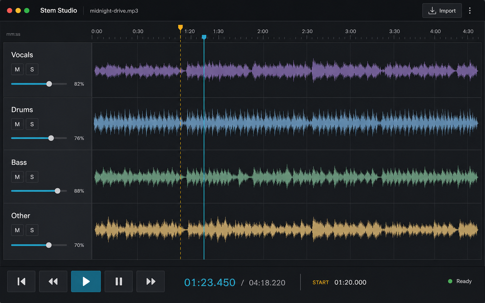

# Stem Studio



Stem Studio est une application desktop macOS qui sépare un MP3 ou WAV en quatre stems avec un
profil Standard (Demucs `htdemucs`) ou High (BS-RoFormer MUSDB18HQ), puis les lit et les mixe sur
une timeline parfaitement synchronisée. Les stems basse et batterie peuvent ensuite être
transcrits en événements musicaux, tablature/grille, MIDI et MusicXML.

Le MVP couvre le flux complet : import par dialogue ou glisser-déposer, séparation asynchrone,
progression et annulation, waveforms communes, lecture/pause/seek, marqueur de départ, volume,
mute et solo. Les vues Bass Tab et Drums restent synchronisées avec le même transport audio.

Les sessions peuvent aussi être exportées dans un dossier portable puis restaurées sans relancer
la séparation. Les commandes de session se trouvent dans la barre supérieure.

## Architecture

```text
.
├── app/
│   ├── src/
│   │   ├── audio/          # AudioEngine Web Audio API, indépendant de React
│   │   ├── components/     # interface DAW
│   │   ├── domain/         # types et logique pure testable
│   │   ├── hooks/          # raccord AudioEngine ↔ Zustand
│   │   ├── services/       # contrat et implémentation du moteur de séparation
│   │   └── state/          # état de projet explicite
│   └── src-tauri/          # commandes Rust, process et permissions Tauri 2
├── engine/
│   ├── domain.py           # contrats StemSeparator, StemResult et progression
│   ├── transcription_domain.py # représentation musicale interne et contrats de transcription
│   ├── transcription_pipeline.py # orchestration basse/batterie
│   ├── basic_pitch_transcriber.py # adaptateur basse Basic Pitch
│   ├── torchcrepe_transcriber.py   # prototype basse monophonique TorchCREPE
│   ├── drumscript_transcriber.py # adaptateur batterie DrumScript
│   ├── beat_tracker.py     # tempo global et positions des temps
│   ├── quantization.py     # timing détecté → positions musicales séparées
│   ├── fretboard.py        # solveur dynamique corde/case configurable
│   ├── gm_drums.py         # normalisation et mapping General MIDI centralisé
│   ├── midi_export.py      # exports MIDI basse et batterie
│   ├── musicxml_export.py  # exports MusicXML tablature/percussions
│   ├── registry.py         # profils produit stables → backends/modèles internes
│   ├── factory.py          # résolution d’un profil vers un StemSeparator
│   ├── audio_io.py         # décodage et encodage indépendants du séparateur
│   ├── project_files.py    # validation et métadonnées communes aux backends
│   ├── demucs_separator.py # implémentation Demucs/MPS/CPU de StemSeparator
│   ├── bs_roformer_separator.py # implémentation BS-RoFormer 4-stem
│   ├── runtime.py          # progression longue et sélection MPS/CPU partagées
│   ├── main.py             # CLI JSON-lines
│   ├── separator.py        # façade compatible avec l’ancienne API fonctionnelle
│   └── stem-engine.spec    # packaging PyInstaller arm64
├── scripts/
│   └── package-engine.sh
└── docs/
    └── stem-studio-design-reference.png
```

L'UI ne connaît pas Demucs : elle dépend du contrat TypeScript `SeparationService`. Côté Python,
les backends se conforment au contrat `StemSeparator` et renvoient tous un `StemResult` à quatre
stems. Les profils produit (`standard`, puis éventuellement `high`) sont résolus par un registre,
sans exposer le nom du modèle au frontend. Le moteur audio ne connaît ni React ni Tauri.

## Prérequis de développement

- macOS 13 ou plus récent, Apple Silicon recommandé ;
- Node.js 20 ou plus récent et npm ;
- Rust stable avec les prérequis Tauri 2 ;
- Python 3.10 à 3.12 arm64 ;
- plusieurs Go libres pour PyTorch, Demucs, le modèle et les WAV temporaires ;
- `ffmpeg` est recommandé pour une compatibilité MP3 maximale en développement
  (`brew install ffmpeg`). Le bundle local utilise toutefois un build arm64 LGPL dédié, décrit
  plus bas ; le FFmpeg Homebrew standard n'est pas accepté pour le packaging.

Installation de Rust si nécessaire :

```bash
xcode-select --install
curl --proto '=https' --tlsv1.2 -sSf https://sh.rustup.rs | sh
rustup default stable
```

## Installation

```bash
cd app
npm install

cd ../engine
python3.11 -m venv .venv311
source .venv311/bin/activate
python -m pip install --upgrade pip
pip install -r requirements.txt
```

Pour reproduire exactement l'environnement Apple Silicon utilisé pour le packaging, installer
plutôt `engine/requirements.lock`. `requirements.txt` reste le fichier servant à faire évoluer
volontairement les dépendances.

Vérifier que Python, PyTorch et le terminal tournent tous en arm64 :

```bash
python -c 'import platform, torch; print(platform.machine(), torch.__version__, torch.backends.mps.is_available())'
```

Un mélange de wheels x86_64 et arm64 ne fonctionnera pas sous Rosetta.

## Lancement en développement

Depuis `app/` :

```bash
npm run tauri dev
```

Le runner Rust cherche, dans cet ordre, `STEM_STUDIO_PYTHON`, `engine/.venv311/bin/python`,
`engine/.venv/bin/python`, puis `python3`. Pour imposer un interpréteur :

```bash
STEM_STUDIO_PYTHON=/chemin/vers/python npm run tauri dev
```

Le frontend seul peut être lancé avec `npm run dev`. Pour visualiser l'état prêt sans Tauri ni
fichiers audio, ouvrir `http://localhost:1420/?demo=ready`. La variante
`?demo=transcription` prévisualise aussi la tablature et la grille batterie avec des données
factices. Ces graines visuelles ne sont activées que dans le navigateur, jamais dans l'application
desktop.

## CLI du moteur

```bash
engine/.venv311/bin/python engine/main.py separate "/path/song.mp3" --output "/tmp/project" --quality standard
```

Profils disponibles :

- `standard` utilise Demucs `htdemucs` et privilégie la vitesse ;
- `high` utilise le modèle BS-RoFormer MUSDB18HQ 4-stem et privilégie la qualité.

Le premier lancement de chaque profil télécharge son modèle. En CLI, les caches par défaut sont
ceux de PyTorch et de BS-RoFormer. L'application desktop utilise des emplacements persistants sous
Application Support :

```text
~/Library/Application Support/studio.stem.desktop/models/
├── torch/hub/checkpoints/   # HTDemucs
└── bs-roformer/             # BS-RoFormer MUSDB18HQ
```

Le modèle BS-RoFormer représente environ 527 Mo. Son checkpoint et sa configuration sont vérifiés
par SHA-256 avant chargement. Pour tester directement :

```bash
engine/.venv311/bin/python engine/main.py separate "/path/song.mp3" --output "/tmp/high-project" --quality high
```

Chaque ligne de stdout est un objet JSON `progress`, `completed` ou `error`. Les logs techniques
et traces restent sur stderr. Le résultat est écrit directement sous les noms `vocals.wav`,
`drums.wav`, `bass.wav` et `other.wav`, avec `source.json`. Le fichier original est uniquement lu.

Les projets desktop sont créés dans :

```text
~/Library/Application Support/studio.stem.desktop/projects/<uuid>/
```

Le cache conserve au maximum cinq projets de moins de sept jours. Les projets plus anciens et
les dossiers d'une séparation annulée ou échouée sont supprimés automatiquement.

## Transcription basse et batterie

Les boutons Transcribe des pistes Bass et Drums invoquent des adaptateurs indépendants du reste
de l'application : Basic Pitch ou TorchCREPE pour la basse, et DrumScript pour la batterie. Le résultat JSON
normalisé reste la source de vérité ; MIDI et MusicXML sont régénérés à partir de ces événements,
jamais utilisés comme représentation interne.

Pour la basse, Basic Pitch n'utilise plus directement sa sortie polyphonique : les probabilités de
notes et d'attaques alimentent un décodeur temporel monophonique, avec un prior pYIN pour arbitrer
les conflits fondamentale/harmonique. Une attaque confirmée peut conserver une note courte sans
transformer les harmoniques simultanées en accords de basse. Les contours sont conservés dans le
JSON et exportés sous forme de pitch bends en MIDI et de bends techniques en MusicXML.

```text
project/transcription/
├── bass.json
├── bass.mid
├── bass.musicxml
├── drums.json
├── drums.mid
└── drums.musicxml
```

Les timestamps détectés sont toujours conservés. La quantification vers noire, croche, double
croche ou triolet écrit des champs séparés. La tablature est calculée par programmation dynamique
pour une basse 4 cordes EADG ou 5 cordes BEADG, sélectionnable avant la transcription. L'analyse
couvre le Si grave (MIDI 23) et le MusicXML déclare le nombre de cordes et l'accordage choisis.
TorchCREPE est proposé comme moteur monophonique expérimental : son suivi neuronal reste dans sa
plage stable à partir de C1, tandis qu'un fallback YIN borné récupère B0 sans remplacer les trames
CREPE fiables. Son décodeur combine la hauteur avec des attaques spectrales : les répétitions
rapides sur une même case restent séparées, les fragments sans nouvelle attaque sont fusionnés,
et une note de 55 ms peut être conservée si une attaque nette la confirme. Le MIDI
batterie utilise le canal 10 et un mapping General MIDI centralisé.

Le tempo choisi conserve également ses interprétations métriques plausibles (half-time ou
double-time) dans `tempoCandidates`. Elles sont affichées dans la vue de transcription et ajoutées
aux avertissements afin qu'une ambiguïté comme 76/152 BPM ne soit plus silencieuse.

Une transcription terminée expose aussi un éditeur de timing. Le BPM peut être choisi parmi les
alternatives détectées ou saisi avec une précision de 0,01 BPM. Le début de la première mesure
peut être saisi en secondes ou repris depuis le marqueur du lecteur. « Apply timing » relit les
événements détectés conservés dans `sourceEvents`, recalcule la grille et la tablature, puis
régénère JSON, MIDI et MusicXML sans relancer le modèle. Les JSON plus anciens sans
`sourceEvents` restent acceptés, avec les événements quantifiés existants comme fallback.

Pour tester directement les deux commandes sur des stems existants :

```bash
engine/.venv311/bin/python engine/main.py transcribe-bass "/path/bass.wav" \
  --bass-tuning beadg --beat-source "/path/drums.wav" --output "/tmp/transcription"

engine/.venv311/bin/python engine/main.py transcribe-bass "/path/bass.wav" \
  --bass-engine torchcrepe --bass-tuning beadg \
  --beat-source "/path/drums.wav" --output "/tmp/transcription"

engine/.venv311/bin/python engine/main.py transcribe-drums "/path/drums.wav" \
  --beat-source "/path/drums.wav" --output "/tmp/transcription"

engine/.venv311/bin/python engine/main.py requantize-bass "/tmp/transcription/bass.json" \
  --bpm 150.08 --first-measure-seconds 1.25 --output "/tmp/transcription"
```

Chaque ligne de stdout est un événement JSON structuré (`transcription_progress`,
`transcription_completed` ou `transcription_error`). Les diagnostics des bibliothèques restent sur
stderr afin de ne pas corrompre le protocole. Un heartbeat fait progresser l'UI durant les étapes
ML longues, même quand la bibliothèque ne fournit pas de progression native.

Les modèles utilisés par l'application sont persistés ici et ne sont pas téléchargés de nouveau :

```text
~/Library/Application Support/studio.stem.desktop/models/
└── basic-pitch/
```

Le petit modèle CoreML distribué avec Basic Pitch est copié dans ce cache au premier usage.
DrumScript utilise un classifieur physique déterministe et n'a pas de poids supplémentaires à
télécharger.

## Sessions portables

Le bouton Save Session crée un nouveau dossier sans écraser une sauvegarde existante :

```text
Mon morceau.stemstudio/
├── session.json
├── vocals.wav
├── drums.wav
├── bass.wav
├── other.wav
└── transcription/          # présent si une transcription a été générée
    ├── bass.json / .mid / .musicxml
    └── drums.json / .mid / .musicxml
```

`session.json` est un manifeste versionné. Il contient des chemins WAV relatifs, le profil de
qualité, la position de lecture, le marqueur de départ, le volume global et les volumes/mute/solo
des quatre pistes. Les métadonnées du moteur sont conservées sans le chemin absolu du fichier
source. Le fichier audio original n'est donc pas nécessaire pour rouvrir une session.
Les transcriptions disponibles sont copiées dans la session, référencées par des chemins relatifs
et restaurées sans relancer Basic Pitch ou DrumScript. Une ancienne session sans transcription reste
compatible.

Pour déplacer ou archiver une session, conserver le dossier `.stemstudio` entier. Open Session
demande de sélectionner son fichier `session.json`, valide que les quatre WAV restent dans ce
dossier, autorise temporairement leur lecture dans Tauri, puis recharge les waveforms et le mix
sans exécuter Demucs ou BS-RoFormer.

## Synchronisation audio

`AudioEngine` décode les quatre WAV dans un seul `AudioContext`. Chaque stem possède un
`GainNode`, et les quatre sources démarrent au même timestamp avec une petite marge :

```text
context.currentTime + 0.05
```

Les `AudioBufferSourceNode` étant one-shot, ils sont systématiquement recréés après pause ou
seek. Le temps de lecture est dérivé de l'horloge du `AudioContext`, pas de quatre horloges DOM.
Le calcul de gain applique les règles de solo avant d'écrire dans les `GainNode`.

## Tests et contrôles

```bash
cd app
npm test
npm run build

cd ../engine
.venv311/bin/python -m unittest discover -s tests
```

Quand Rust est installé :

```bash
cd app/src-tauri
cargo fmt --check
cargo check
cargo test
```

`npm run test:coverage` applique les seuils de couverture. La CI macOS rejoue le build frontend,
les tests Python/Rust et génère un SBOM CycloneDX avec `scripts/generate-sbom.py`. L'inventaire
humain des licences principales se trouve dans `docs/THIRD_PARTY_NOTICES.md`.

### Corpus QA basse

Le manifeste [`qa/bass-corpus.json`](qa/bass-corpus.json) décrit le WAV isolé, le MIDI corrigé,
le BPM de référence, la tolérance d'attaque et l'alignement du passage annoté. Le MIDI de 36
mesures fourni localement reste dans `~/Downloads/bass-corrigé.mid` ; il n'est pas dupliqué dans
le projet. Pour rejouer les deux moteurs et refuser une régression par rapport à la baseline :

```bash
cd engine
.venv311/bin/python run_bass_corpus.py ../qa/bass-corpus.json \
  --engine basic-pitch --engine torchcrepe \
  --output /tmp/stem-studio-bass-corpus \
  --baseline ../qa/bass-baseline.json
```

Le rapport mesure précision/rappel/F1 des notes et des attaques, exactitude de hauteur, erreurs
d'octave, erreurs de durée, rappel des notes courtes, des notes répétées et du Si grave. Une baisse
supérieure aux tolérances de `REGRESSION_RULES` termine avec le code 2. Un JSON déjà produit peut
être contrôlé sans relancer le modèle avec
`--prediction 'bass-corrected-36-bars/basic-pitch=/chemin/bass.json'`. La baseline ne doit être
remplacée avec `--write-baseline` qu'après validation auditive de l'amélioration.

La baseline initiale contient 208 notes corrigées. Basic Pitch obtient actuellement un F1 notes
de 0,488 et un F1 attaques de 0,647. TorchCREPE obtient respectivement 0,451 et 0,614, mais rappelle
mieux les notes répétées (0,392 contre 0,233) et produit moins d'erreurs d'octave sur les attaques
appariées (20 contre 30). Ces valeurs servent de point de départ, pas d'objectif de qualité final.

Checklist manuelle :

1. importer un MP3 puis un WAV par le bouton et par glisser-déposer ;
2. vérifier que l'UI reste réactive pendant Demucs et que Cancel arrête le process ;
3. contrôler au casque un transitoire net avec les quatre stems actifs, puis après plusieurs seeks ;
4. vérifier mute, plusieurs solos simultanés, et la combinaison solo + mute ;
5. glisser le marqueur ambre, cliquer ailleurs pour déplacer la tête cyan, puis lire depuis le marqueur ;
6. tester Espace quand le focus est sur la timeline puis sur un slider ;
7. redimensionner à 700 × 520 et vérifier absence de contenu coupé ;
8. forcer un fichier invalide, un disque presque plein et l'arrêt du sidecar ;
9. sauvegarder une session, déplacer son dossier, puis restaurer `session.json` sans relancer l'inférence ;
10. sur Apple Silicon, tester une séparation MPS puis simuler un échec pour observer le retry CPU.
11. transcrire Bass, cliquer sur une case et vérifier le seek au timestamp brut ;
12. exporter `bass.mid` et `bass.musicxml`, puis les ouvrir dans MuseScore ;
13. transcrire Drums, contrôler kick/snare/hi-hat dans la grille puis dans MuseScore ;
14. sauvegarder et restaurer la session, puis vérifier que les deux onglets sont encore prêts.

Validation MuseScore recommandée : ouvrir chaque `.musicxml`, vérifier les mesures, le tempo, les
silences, les cordes/cases de basse et les positions de percussion. Ouvrir ensuite le `.mid`
correspondant et écouter en parallèle de l'original. Guitar Pro, Dorico ou Sibelius peuvent aussi
importer le MusicXML ; aucun format Guitar Pro natif n'est écrit par ce MVP.

## Construction de l'application locale

Le moteur Python est transformé en bundle autonome PyInstaller `onedir`, sans aucun poids de modèle.
FFmpeg est embarqué séparément afin que les MP3 fonctionnent lorsque l'application est lancée
depuis Finder, sans dépendre du `PATH` du terminal.

### Compiler FFmpeg 9.0.1 arm64 sous LGPL

Le FFmpeg destiné au bundle doit être natif Apple Silicon et compilé sans les options GPL ou
nonfree. En particulier, ne pas activer x264 ou x265. Depuis la racine du projet :

```bash
mkdir -p stem-studio-ffmpeg
cd stem-studio-ffmpeg

curl -LO https://ffmpeg.org/releases/ffmpeg-9.0.1.tar.xz
shasum -a 256 ffmpeg-9.0.1.tar.xz
# attendu : cf38e0e28c7e5605942c4a77755349b0145804a397af37eb1fb4c77cb237f635

tar -xf ffmpeg-9.0.1.tar.xz
cd ffmpeg-9.0.1

./configure \
  --prefix="$PWD/build" \
  --arch=arm64 \
  --cc=clang \
  --disable-gpl \
  --disable-nonfree \
  --disable-doc \
  --disable-debug \
  --disable-ffplay \
  --disable-ffprobe \
  --disable-sdl2 \
  --enable-audiotoolbox \
  --enable-static \
  --disable-shared

make -j"$(sysctl -n hw.logicalcpu)"
make install
```

Vérifier ensuite l'architecture, les dépendances et la configuration du binaire :

```bash
file build/bin/ffmpeg
otool -L build/bin/ffmpeg
build/bin/ffmpeg -hide_banner -buildconf
```

La sortie de `file` doit contenir `Mach-O 64-bit executable arm64`. La configuration ne doit
contenir ni `--enable-gpl`, ni `--enable-nonfree`, ni `--enable-libx264`, ni `--enable-libx265`.
Ce profil suffit au décodage MP3/WAV et à la production des WAV utilisés par Stem Studio.

Revenir à la racine et transmettre explicitement ce binaire au script de construction :

```bash
cd ../..
STEM_STUDIO_FFMPEG="$PWD/stem-studio-ffmpeg/ffmpeg-9.0.1/build/bin/ffmpeg" \
  ./scripts/build-local-app.sh
```

Le script valide lui-même l'architecture et les options de licence avant de copier FFmpeg dans
la `.app`. Le dossier `stem-studio-ffmpeg/` est un dossier de travail local et ne doit pas être
commité en entier.

### Construire la `.app`

Lorsque `STEM_STUDIO_FFMPEG` pointe déjà vers un binaire conforme, une seule commande construit
le moteur puis la `.app` Tauri :

```bash
./scripts/build-local-app.sh
```

Cette construction nécessite Node, Rust et `engine/.venv311` (ou
`STEM_STUDIO_ENGINE_VENV=/chemin/vers/venv`) sur la machine de développement. Une
fois `Stem Studio.app` copiée dans `/Applications`, son utilisation ne nécessite plus npm, Cargo,
Python ou le virtualenv. Les modèles sont téléchargés lors de la première utilisation puis restent
dans Application Support, indépendamment des reconstructions de l'application.

Le script de construction :

1. exécute PyInstaller avec les hooks Demucs, BS-RoFormer, Basic Pitch, TorchCREPE, DrumScript, PyTorch et torchaudio ;
2. localise un FFmpeg arm64 et l'ajoute comme second sidecar ;
3. place le dossier moteur et FFmpeg sous les noms attendus dans `app/src-tauri/binaries/` ;
4. compile le frontend puis l'application Tauri ;
5. indique les emplacements de la `.app` et du DMG produits.

Pour construire uniquement le sidecar :

```bash
./scripts/package-engine.sh
```

Ne commitez pas les dossiers de travail PyInstaller ou le dossier complet de compilation FFmpeg.
Aucun poids n'est copié dans `app/src-tauri/resources` ou dans la `.app`, à l'exception du petit
modèle CoreML fourni par le package Basic Pitch et du checkpoint TorchCREPE `tiny` d'environ 2 Mo.
Le checkpoint TorchCREPE `full` d'environ 89 Mo est explicitement exclu du sidecar.

### Publier le binaire FFmpeg sur GitHub

Le binaire arm64 produit par la procédure ci-dessus fait environ 21 Mo. Il peut techniquement être
versionné directement dans Git, mais cela alourdit chaque clone et chaque révision reste dans
l'historique. La solution recommandée est de le publier comme asset d'une GitHub Release, avec :

- `ffmpeg-9.0.1-macos-arm64` : le binaire exécutable ;
- `ffmpeg-9.0.1.tar.xz` : le tarball source exact utilisé pour ce binaire ;
- `COPYING.LGPLv2.1` et `LICENSE.md` issus du même tarball ;
- la ligne `configure` ci-dessus et les sommes SHA-256 des deux artefacts.

Publier le binaire constitue une redistribution de FFmpeg. Il faut donc conserver les mentions
LGPL, fournir le code source correspondant exactement au binaire et indiquer que Stem Studio
utilise FFmpeg sous LGPL 2.1 ou ultérieure. `docs/THIRD_PARTY_NOTICES.md` contient l'inventaire
du bundle ; une future page de téléchargement devra aussi pointer vers les sources FFmpeg de la
Release correspondante. Pour un binaire conservé directement dans le dépôt, Git LFS est une
alternative acceptable, mais une Release reste mieux adaptée aux artefacts compilés.

### Signature et notarisation

Cette étape n'est pas nécessaire pour une application construite et utilisée uniquement sur ce
Mac. En cas de diffusion ultérieure, PyInstaller embarque de nombreuses bibliothèques dynamiques
PyTorch. Le sidecar doit alors être signé
avec la même identité que l'application avant la signature finale du bundle. Pour une diffusion
hors Mac App Store, configurez les variables de signature Tauri/Apple, signez en profondeur les
bibliothèques embarquées, puis notarisez et staplez le DMG. Testez toujours le bundle sur un Mac
propre sans Python, pip, Demucs ni PyTorch. Les modèles Standard et High ne sont pas inclus dans
le bundle : ils sont téléchargés lors de leur première utilisation dans Application Support.

Après un build local, `scripts/verify-macos-app.sh` contrôle la structure et les signatures du
bundle. Pour une diffusion, configurez d'abord la signature Tauri avec une identité Developer ID,
créez un profil `notarytool`, puis exécutez
`APPLE_NOTARY_PROFILE=stem-studio scripts/notarize-macos-dmg.sh /chemin/Stem\ Studio.dmg`.
Avec `STEM_STUDIO_REQUIRE_NOTARIZATION=1`, la vérification exige aussi une évaluation Gatekeeper
et un ticket agrafé. Sans artefact exporté et certificat Developer ID, le dépôt seul ne peut pas
prouver la notarisation.

PyInstaller ne produit pas un binaire universel fiable pour PyTorch : construisez séparément par
architecture. Le profil fourni cible `arm64`. Un build Intel nécessiterait un environnement et un
artefact séparés, puis éventuellement un assemblage maîtrisé ; ce n'est pas couvert ici.

## Build macOS sans sidecar packagé

`npm run tauri dev` utilise le virtualenv de développement. Un build de distribution doit suivre
la procédure précédente : sans le fichier dans `binaries/`, Tauri refuse volontairement le build
configuré, afin de ne pas livrer une application incapable de séparer l'audio.

## MPS et fallback CPU

Le moteur choisit MPS quand `torch.backends.mps.is_available()` est vrai. Demucs et certaines
versions de PyTorch peuvent néanmoins rencontrer une opération non supportée, une pression
mémoire ou un comportement différent selon la durée du morceau. Toute erreur de l'essai MPS
provoque une nouvelle instance `htdemucs` sur CPU. Si le retry échoue, seule une erreur courte est
envoyée à l'UI ; le détail reste dans stderr.

Le retry complet double potentiellement le temps d'attente. C'est volontaire : réutiliser un
modèle ou des tenseurs partiellement exécutés après une erreur MPS est plus fragile.

Le backend High suit la même politique : Torch/MPS est essayé en premier, puis une nouvelle
session BS-RoFormer est créée sur CPU si l'accélérateur échoue. High est sensiblement plus lent et
plus gourmand en mémoire que Standard.

## Permissions et sécurité

- le frontend n'a pas de permission shell ;
- seules les commandes Rust dédiées à la séparation/transcription lancent ou arrêtent le moteur ;
- `save_session` copie les quatre WAV et les transcriptions attendues puis écrit un nouveau manifeste ;
- `load_session` refuse les chemins absolus, les traversées `..`, les stems hors du dossier et les
  valeurs de mixage invalides ;
- le dialogue n'autorise que l'ouverture ;
- le protocole asset est limité aux projets internes et aux dossiers de session validés pendant
  leur ouverture ;
- la commande Rust revalide l'existence du fichier et son extension ;
- aucun accès réseau ou backend distant n'est exposé au frontend ; les moteurs Standard et High
  téléchargent leurs checkpoints lors de leur première utilisation.

## Problèmes connus et risques

- Le bundle PyTorch/Demucs reste volumineux même sans les poids ; prévoyez plusieurs centaines de
  Mo pour la `.app`, auxquels s'ajoutent les caches téléchargés dans Application Support.
- FFmpeg est inclus dans la construction locale pour fiabiliser MP3 et WAV depuis Finder ; le
  script exige un binaire arm64 LGPL et refuse les builds GPL/nonfree, x264 ou x265.
- MPS n'est pas garanti pour toutes les versions de PyTorch/Demucs ; le CPU est plus lent mais
  constitue le chemin de secours.
- La première utilisation de chaque profil doit disposer d'un accès réseau pour récupérer ses
  poids. Les lancements suivants utilisent les caches d'Application Support.
- Le checkpoint BS-RoFormer MUSDB18HQ est référencé par le registre amont avec une licence
  `not-reviewed`. Sa redistribution commerciale doit rester bloquée jusqu'à revue de sa licence
  et de sa provenance ; le code de l'application ne l'embarque pas.
- `bs-roformer-infer` est temporairement figé sur un commit officiel car son API session et son
  registre MUSDB18HQ 4-stem ne sont pas encore disponibles dans la version PyPI 0.1.5.
- Les sources sont limitées à 1 Gio et le décodage à 30 minutes ; le cache garde cinq projets
  pendant sept jours au maximum.
- La compilation Rust/Tauri requiert une toolchain Rust locale ; le frontend et le moteur Python
  peuvent être testés indépendamment.
- La transcription est probabiliste : ghost notes, notes très courtes, slides, hammer-on/pull-off,
  slap, accords de basse, double kick rapide, cymbales superposées, swing, tempos variables et
  changements de signature peuvent produire des erreurs.
- Le solveur de manche optimise les lignes monophoniques. Il conserve les notes simultanées et
  tente des cordes distinctes, mais les accords/double-stops complexes restent un fallback.
- DrumScript distingue kick, snare, hi-hat ouvert/fermé, ride/crash et les trois familles de toms.
  Les passages très denses de cymbales et de toms peuvent encore demander une correction manuelle.
- Le MVP utilise un tempo global et une signature 4/4 détectée/présumée ; les cartes de tempo et
  signatures multiples sont prévues par les modèles mais pas encore estimées.

## Référence visuelle

La maquette source est conservée dans `docs/stem-studio-design-reference.png`. L'interface finale
reprend sa densité, sa grille continue, le cyan de lecture et le marqueur ambre, tout en conservant
les contrôles en HTML/CSS accessibles.
